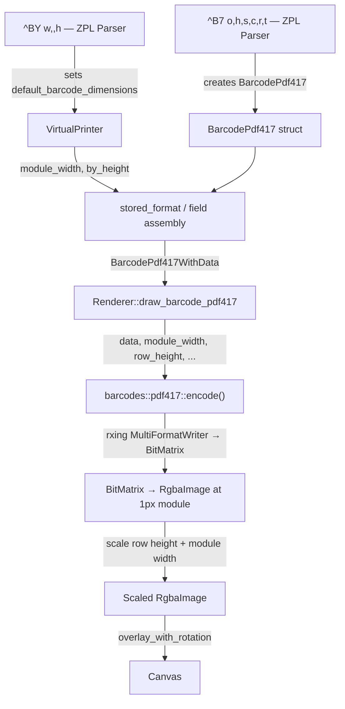
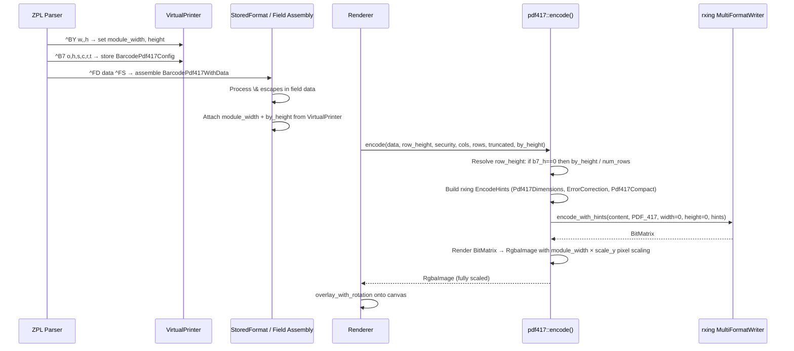

# Design Document: PDF417 Barcode ZPL Compliance

## Overview

The PDF417 barcode (`^B7`) implementation in Labelize has ~18% pixel diff against Labelary reference renders due to several gaps: module width scaling is ignored, row height fallback from `^BY` is not applied, text compaction mode is unused, the 1:2 default aspect ratio is not enforced, validation for the 928-codeword cap is missing, and `\&` CR/LF escapes are not processed for PDF417 field data.

Additionally, the current `pdf417` crate (v0.2.1) uses `#![feature(const_mut_refs)]` which was stabilized in Rust 1.83. On stable toolchains ≥1.83 this causes a compile error (`E0554`), and no newer version of the crate exists. The fix is to replace the `pdf417` crate with `rxing`'s built-in PDF417 writer, which is already a project dependency and follows the same pattern used for Aztec barcode encoding.

This design addresses all gaps plus the crate migration to bring the `^B7` rendering into full compliance with the Zebra ZPL Programming Guide specification. The changes span five files: the dependency manifest (`Cargo.toml`), the parser (`zpl_parser.rs`), the element struct (`barcode_pdf417.rs`), the encoder (`barcodes/pdf417.rs`), and the renderer (`renderer.rs`).

## Architecture

The existing pipeline remains unchanged. The fix threads `^BY` dimensions through the element struct into the encoder, replaces the encoding backend with `rxing`, and adds scaling + validation logic.





## Components and Interfaces

### Component 1: Cargo.toml — Dependency Change

Remove the `pdf417` crate dependency. The `rxing` crate (already present) provides PDF417 encoding via `MultiFormatWriter` with `BarcodeFormat::PDF_417`.

```toml
# REMOVE:
# pdf417 = "0.2.1"

# KEEP (already present):
rxing = { version = "0.8", default-features = false, features = ["encoding_rs"] }
```

### Component 2: BarcodePdf417 Element Struct

`src/elements/barcode_pdf417.rs` — Add `module_width` and `by_height` fields so the renderer has access to `^BY` parameters.

```rust
#[derive(Clone, Debug)]
pub struct BarcodePdf417 {
    pub orientation: FieldOrientation,
    pub row_height: i32,       // ^B7 h parameter (0 = use ^BY fallback)
    pub security: i32,         // ^B7 s parameter (0 = auto, 1-8 = explicit)
    pub columns: i32,          // ^B7 c parameter (0 = auto)
    pub rows: i32,             // ^B7 r parameter (0 = auto)
    pub truncate: bool,        // ^B7 t parameter
    pub module_width: i32,     // NEW — from ^BY w (default 2)
    pub by_height: i32,        // NEW — from ^BY h (default 10)
}
```

### Component 3: ZPL Parser — parse_barcode_pdf417

`src/parsers/zpl_parser.rs` — Capture `module_width` and `by_height` from VirtualPrinter's `default_barcode_dimensions` when constructing the BarcodePdf417 config.

```rust
fn parse_barcode_pdf417(&mut self, command: &str) {
    let parts = split_command(command, "^B7");
    let mut bc = BarcodePdf417 {
        orientation: self.printer.default_orientation,
        row_height: 0,
        security: 0,
        columns: 0,
        rows: 0,
        truncate: false,
        module_width: self.printer.default_barcode_dimensions.module_width,
        by_height: self.printer.default_barcode_dimensions.height,
    };
    // ... existing parameter parsing unchanged ...
}
```

### Component 4: PDF417 Encoder — rxing Migration

`src/barcodes/pdf417.rs` — Complete rewrite to use `rxing::MultiFormatWriter` instead of the `pdf417` crate. Follows the same pattern as `src/barcodes/aztec.rs`.

```rust
use image::{Rgba, RgbaImage};
use rxing::pdf417::encoder::Dimensions;
use rxing::{BarcodeFormat, EncodeHintValue, EncodeHints, MultiFormatWriter, Writer};

/// Resolve the effective row height for PDF417 rendering.
fn resolve_row_height(b7_row_height: i32, by_height: i32, num_rows: u32) -> u32 {
    if b7_row_height > 0 {
        b7_row_height as u32
    } else {
        (by_height as u32 / num_rows).max(1)
    }
}

/// Generate a PDF417 barcode image using rxing's MultiFormatWriter.
pub fn encode(
    content: &str,
    row_height: i32,
    security_level: i32,
    column_count: i32,
    row_count: i32,
    truncated: bool,
    by_height: i32,
) -> Result<RgbaImage, String> {
    if content.is_empty() {
        return Err("PDF417: empty content".to_string());
    }

    // Build rxing encode hints
    let mut hints = EncodeHints::default();
    hints = hints.with(EncodeHintValue::Margin("0".to_string()));

    // Security level (0 = auto, 1-8 = explicit)
    if security_level > 0 && security_level <= 8 {
        hints = hints.with(EncodeHintValue::ErrorCorrection(
            security_level.to_string(),
        ));
    }

    // Truncated PDF417
    if truncated {
        hints = hints.with(EncodeHintValue::Pdf417Compact("true".to_string()));
    }

    // Column/row constraints via Pdf417Dimensions
    // rxing uses min/max ranges; we set min==max to force exact values
    let min_cols = if column_count > 0 { column_count.clamp(1, 30) as usize } else { 1 };
    let max_cols = if column_count > 0 { column_count.clamp(1, 30) as usize } else { 30 };
    let min_rows = if row_count > 0 { row_count.clamp(3, 90) as usize } else { 3 };
    let max_rows = if row_count > 0 { row_count.clamp(3, 90) as usize } else { 90 };
    hints = hints.with(EncodeHintValue::Pdf417Dimensions(
        Dimensions::new(min_cols, max_cols, min_rows, max_rows),
    ));

    // Encode via rxing — returns a BitMatrix at 1px module width
    let writer = MultiFormatWriter::default();
    let bit_matrix = writer
        .encode_with_hints(content, &BarcodeFormat::PDF_417, 0, 0, &hints)
        .map_err(|e| format!("PDF417 encoding failed: {}", e))?;

    let bm_width = bit_matrix.getWidth();
    let bm_height = bit_matrix.getHeight();

    // rxing renders at 1px per module, 1px per row.
    // We need to scale: module_width horizontally, row_height vertically.
    // The number of symbol rows = bm_height (each row is 1px in the BitMatrix).
    let num_rows = bm_height;
    let scale_y = resolve_row_height(row_height, by_height, num_rows);

    let img_width = bm_width;  // 1px module width; renderer scales by module_width
    let img_height = bm_height * scale_y;

    let mut img = RgbaImage::from_pixel(img_width, img_height, Rgba([0, 0, 0, 0]));
    let black = Rgba([0, 0, 0, 255]);

    for y in 0..bm_height {
        for x in 0..bm_width {
            if bit_matrix.get(x, y) {
                let py = y * scale_y;
                for dy in 0..scale_y {
                    img.put_pixel(x, py + dy, black);
                }
            }
        }
    }

    Ok(img)
}
```

Key differences from the old `pdf417` crate approach:

- `rxing` handles text compaction, byte compaction, and numeric compaction automatically based on input data — no manual mode selection needed
- `rxing` handles the 928-codeword capacity validation internally and returns an error if exceeded
- `rxing` handles default aspect ratio (1:2 row-to-column) when dimensions are unconstrained
- `Pdf417Dimensions` hint controls min/max columns and rows, matching ZPL's column/row parameters
- `Pdf417Compact` hint enables truncated PDF417 mode
- `ErrorCorrection` hint sets the security level (0-8)
- The `BitMatrix` output is at 1px per module, 1px per row — we scale rows by `scale_y` in the encoder, and the renderer scales horizontally by `module_width`

### Component 5: Renderer — Module Width Scaling

`src/drawers/renderer.rs` — After encoding, scale the image horizontally by `module_width` before overlay.

```rust
fn draw_barcode_pdf417(
    &self,
    canvas: &mut RgbaImage,
    bc: &crate::elements::barcode_pdf417::BarcodePdf417WithData,
) -> Result<(), String> {
    let img = barcodes::pdf417::encode(
        &bc.data,
        bc.barcode.row_height,
        bc.barcode.security,
        bc.barcode.columns,
        bc.barcode.rows,
        bc.barcode.truncate,
        bc.barcode.by_height,
    )?;

    // Scale horizontally by module_width (^BY w parameter)
    let mw = bc.barcode.module_width.max(1) as u32;
    let scaled = if mw > 1 {
        image::imageops::resize(
            &img,
            img.width() * mw,
            img.height(),
            image::imageops::FilterType::Nearest,
        )
    } else {
        img
    };

    let pos = adjust_image_typeset_position(&scaled, &bc.position, bc.barcode.orientation);
    overlay_with_rotation(canvas, &scaled, &pos, bc.barcode.orientation);
    Ok(())
}
```

### Component 6: Field Data Escape Processing

`src/elements/stored_format.rs` — The existing `\&` → `\n` replacement already runs on all field data before element construction. This covers PDF417 as well. No change needed here.

## Data Models

### BarcodeDimensions (unchanged)

```rust
pub struct BarcodeDimensions {
    pub module_width: i32,  // ^BY w — default 2
    pub height: i32,        // ^BY h — default 10
    pub width_ratio: f64,   // ^BY r — default 3.0 (fixed for PDF417, ignored)
}
```

### BarcodePdf417 Field Mapping

| ^B7 Param | Struct Field  | Default              | Range          |
| --------- | ------------- | -------------------- | -------------- |
| o         | orientation   | ^FW value            | N/R/I/B        |
| h         | row_height    | 0 (use ^BY fallback) | 1..label_height |
| s         | security      | 0 (auto)             | 0-8            |
| c         | columns       | 0 (auto)             | 0-30           |
| r         | rows          | 0 (auto)             | 0-90           |
| t         | truncate      | false                | N/Y            |
| (^BY w)   | module_width  | 2                    | 1..∞           |
| (^BY h)   | by_height     | 10                   | 1..∞           |

## Algorithmic Pseudocode

### Row Height Resolution Algorithm

```rust
/// ZPL spec: ^B7 h parameter is "bar code height for individual rows".
/// When h=0 (not specified), use ^BY height / number_of_rows.
fn resolve_row_height(b7_row_height: i32, by_height: i32, num_rows: u32) -> u32 {
    if b7_row_height > 0 {
        b7_row_height as u32
    } else {
        (by_height as u32 / num_rows).max(1)
    }
}
```

Preconditions:

- `by_height` ≥ 1
- `num_rows` ≥ 3 (PDF417 minimum)

Postconditions:

- Returns value ≥ 1
- When `b7_row_height > 0`, returns it directly
- When `b7_row_height == 0`, returns `by_height / num_rows` (integer division, min 1)

### rxing Hint Construction

The `rxing` library handles dimension calculation, compaction mode selection, and capacity validation internally. Our encoder constructs hints to constrain the output:

| ZPL Parameter | rxing Hint | Mapping |
| ------------- | ---------- | ------- |
| ^B7 s (security) | `ErrorCorrection` | `s.to_string()` (1-8), omit for auto |
| ^B7 c (columns) | `Pdf417Dimensions` | `min_cols=max_cols=c` when specified |
| ^B7 r (rows) | `Pdf417Dimensions` | `min_rows=max_rows=r` when specified |
| ^B7 t (truncate) | `Pdf417Compact` | `"true"` when truncated |
| (none) | `Margin` | `"0"` always (no quiet zone, matches Labelary) |

When columns or rows are 0 (auto), the Dimensions hint uses the full valid range (1-30 for cols, 3-90 for rows), letting rxing choose optimal dimensions with its built-in 1:2 aspect ratio logic.

## Key Functions with Formal Specifications

### Function: resolve_row_height()

```rust
fn resolve_row_height(b7_row_height: i32, by_height: i32, num_rows: u32) -> u32
```

Preconditions:

- `by_height` ≥ 1
- `num_rows` ≥ 3

Postconditions:

- Result ≥ 1
- If `b7_row_height > 0`: result == `b7_row_height as u32`
- If `b7_row_height == 0`: result == max(1, `by_height / num_rows`)

### Function: encode() (revised)

```rust
pub fn encode(
    content: &str, row_height: i32, security_level: i32,
    column_count: i32, row_count: i32, truncated: bool, by_height: i32,
) -> Result<RgbaImage, String>
```

Preconditions:

- `content` non-empty, ≤ 3K characters
- `column_count` in 0..=30, `row_count` in 0..=90
- `security_level` in 0..=8
- `by_height` ≥ 1

Postconditions:

- Returns 1-pixel-module-width RgbaImage on success
- Returns `Err` if content empty or rxing encoding fails (capacity exceeded, data too large, etc.)
- Row height resolved per ZPL spec fallback rules
- Text/byte/numeric compaction selected automatically by rxing

## Example Usage

```rust
// Example 1: Basic PDF417 with ^BY module width
// ZPL: ^XA ^BY3,,40 ^FO50,50 ^B7N,0,2,5,0,N ^FDHello World^FS ^XZ
// module_width=3, by_height=40, b7_h=0, security=2, cols=5, rows=auto
let img = barcodes::pdf417::encode("Hello World", 0, 2, 5, 0, false, 40)?;
// img is at 1px module width; renderer scales by 3x horizontally

// Example 2: Explicit row height overrides ^BY
// ZPL: ^XA ^BY2,,100 ^FO50,50 ^B7N,8,0,0,0,N ^FDTest^FS ^XZ
let img = barcodes::pdf417::encode("Test", 8, 0, 0, 0, false, 100)?;
// Row height = 8px (from ^B7 h), not 100/rows

// Example 3: Default aspect ratio (no cols/rows specified)
// ZPL: ^XA ^FO50,50 ^B7N ^FDSome data here^FS ^XZ
let img = barcodes::pdf417::encode("Some data here", 0, 0, 0, 0, false, 10)?;
// cols and rows auto-calculated by rxing with 1:2 aspect ratio

// Example 4: Truncated PDF417
// ZPL: ^XA ^FO50,50 ^B7N,,0,0,0,Y ^FDTruncated^FS ^XZ
let img = barcodes::pdf417::encode("Truncated", 0, 0, 0, 0, true, 10)?;

// Example 5: CR/LF via \& escape
// ZPL: ^XA ^FO50,50 ^B7N ^FDLine1\&Line2^FS ^XZ
// After stored_format processing: data = "Line1\nLine2"
let img = barcodes::pdf417::encode("Line1\nLine2", 0, 0, 0, 0, false, 10)?;
```

## Correctness Properties

The following properties must hold for all valid inputs:

1. **Module width scaling**: For any `module_width` m ≥ 1, the final rendered barcode image width equals `encode_result.width() × m`.

2. **Row height fallback**: When `^B7 h == 0`, the row height used equals `max(1, by_height / num_rows)`. When `^B7 h > 0`, the row height equals `h` regardless of `^BY` height.

3. **Aspect ratio default**: When both `columns == 0` and `rows == 0`, rxing applies its built-in 1:2 row-to-column aspect ratio.

4. **Capacity validation**: rxing returns an encoding error when the data exceeds the symbol capacity (cols × rows > 928 or data too large). The encoder propagates this as `Err`.

5. **Compaction mode**: rxing automatically selects the optimal compaction mode (text, byte, or numeric) based on input data. No manual mode selection is needed.

6. **Escape processing**: The `\&` sequence in `^FD` field data is converted to `\n` (0x0A) before reaching the encoder. This is handled by the existing universal escape processing in `stored_format.rs`.

7. **Image dimensions**: The output image height equals `bm_height × scale_y` where `bm_height` is the number of symbol rows from rxing's BitMatrix. The output image width equals `bm_width` (1px per module); the renderer scales by `module_width`.

## Error Handling

### Error: rxing Encoding Failure

**Condition**: rxing's `MultiFormatWriter::encode_with_hints` returns an error (capacity exceeded, invalid parameters, data too large, etc.).
**Response**: Return `Err(format!("PDF417 encoding failed: {}", e))`.
**Recovery**: Caller (renderer) propagates error; no barcode is drawn on canvas.

### Error: Empty Content

**Condition**: `^FD` field data is empty.
**Response**: Return `Err("PDF417: empty content")`.
**Recovery**: No barcode drawn.

## Testing Strategy

### Unit Testing Approach

Update tests in `tests/unit_barcodes.rs` to match the new `encode()` signature (added `by_height` parameter):

- `pdf417_encodes_text` — encode "Hello World", verify non-empty image
- `pdf417_empty_input_returns_error` — encode "", verify Err
- `pdf417_row_height_fallback_from_by` — encode with b7_h=0 and by_height=40, verify image height uses fallback
- `pdf417_explicit_row_height_overrides_by` — encode with b7_h=5, verify image height = bm_rows × 5
- `pdf417_truncated_mode` — encode with truncated=true, verify narrower image than non-truncated
- `pdf417_crlf_in_data` — encode "A\nB", verify success

### Property-Based Testing Approach

**Property Test Library**: `proptest` (already in dev-dependencies)

Key properties to test with random inputs:

- For any non-empty ASCII string ≤ 100 chars, encode succeeds with default parameters
- Output image width > 0 and height > 0 for all successful encodes
- Row height resolution is idempotent and monotonic in by_height

### Integration / E2E Testing

- Run existing `cargo test --test e2e_golden` to verify diff percentages decrease
- The PDF417 golden test threshold should drop from ~18% toward <5%

## Performance Considerations

- rxing handles compaction mode selection internally, producing optimal codeword sequences
- Horizontal scaling via `image::imageops::resize` with `Nearest` filter is O(width × height) — negligible for barcode-sized images
- No additional allocations beyond the BitMatrix and image buffer

## Security Considerations

- Field data is capped at 3K characters per ZPL spec — no unbounded allocation
- All integer parameters are clamped to valid ranges before use
- No unsafe code introduced

## Dependencies

- `rxing` crate v0.8 (existing) — provides `MultiFormatWriter`, `BarcodeFormat::PDF_417`, `EncodeHintValue::Pdf417Dimensions`, `EncodeHintValue::Pdf417Compact`, `EncodeHintValue::ErrorCorrection`. Handles text/byte/numeric compaction automatically.
- `image` crate v0.25 (existing) — provides `imageops::resize` with `FilterType::Nearest`
- `pdf417` crate v0.2.1 — **REMOVED** (compile error on stable Rust ≥1.83 due to `#![feature(const_mut_refs)]`, no newer version available)
