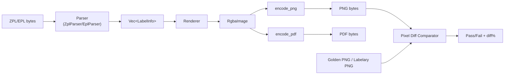

# Design Document: Test Module Design for Labelize

## Overview

This design describes the comprehensive test infrastructure for the labelize project — a Rust ZPL/EPL label renderer. The test suite is organized into three tiers:

1. **Unit tests** — isolated tests for each module (parsers, barcode generators, renderer, encoders, hex/encoding utilities)
2. **Property-based tests** — proptest-driven tests that verify invariants across randomly generated inputs
3. **E2E tests** — golden-file regression tests and Labelary API comparison tests

The test infrastructure replaces the current single-file `tests/e2e_golden.rs` (50% tolerance) with a structured, multi-module test suite targeting 15% tolerance for new tests and providing shared helpers for rendering, image comparison, and Labelary API interaction.

### Key Design Decisions

- **Test organization**: `tests/unit/`, `tests/e2e/`, `tests/common/` as separate integration test modules, plus `#[cfg(test)] mod tests` inside source files for tightly-coupled unit tests
- **Labelary client**: Uses `reqwest` (blocking) as a new dev-dependency for HTTP calls, with file-based caching in `testdata/labelary_cache/` and a token-bucket rate limiter (3 req/sec)
- **Image comparison**: Extends the existing `pixel_diff_percent` approach with per-test tolerances, diff image generation, and optional SSIM comparison
- **proptest**: Already in dev-dependencies; strategies will be defined in `tests/common/` for reuse across property tests
- **Golden file updates**: Controlled via `LABELIZE_UPDATE_GOLDEN` env var

## Architecture

```mermaid
graph TD
    subgraph "Test Modules"
        UT_ZPL["tests/unit/zpl_parser.rs"]
        UT_EPL["tests/unit/epl_parser.rs"]
        UT_BC["tests/unit/barcodes.rs"]
        UT_REND["tests/unit/renderer.rs"]
        UT_PNG["tests/unit/png_encoder.rs"]
        UT_PDF["tests/unit/pdf_encoder.rs"]
        UT_HEX["tests/unit/hex_encoding.rs"]
        PT["tests/unit/property_tests.rs"]
        E2E_GOLDEN["tests/e2e/golden.rs"]
        E2E_LABELARY["tests/e2e/labelary.rs"]
    end

    subgraph "Shared Helpers (tests/common/)"
        MOD_COMMON["mod.rs"]
        RENDER_HELPERS["render_helpers.rs"]
        IMAGE_COMPARE["image_compare.rs"]
        LABELARY_CLIENT["labelary_client.rs"]
        PROPTEST_STRATS["proptest_strategies.rs"]
    end

    subgraph "Source Under Test"
        SRC_ZPL["parsers::zpl_parser"]
        SRC_EPL["parsers::epl_parser"]
        SRC_BC["barcodes::*"]
        SRC_REND["drawers::renderer"]
        SRC_PNG["images::monochrome"]
        SRC_PDF["images::pdf"]
        SRC_HEX["hex::*"]
        SRC_ENC["encodings::*"]
    end

    UT_ZPL --> SRC_ZPL
    UT_EPL --> SRC_EPL
    UT_BC --> SRC_BC
    UT_REND --> SRC_REND
    UT_PNG --> SRC_PNG
    UT_PDF --> SRC_PDF
    UT_HEX --> SRC_HEX
    UT_HEX --> SRC_ENC
    PT --> SRC_ZPL & SRC_BC & SRC_PNG & SRC_HEX

    E2E_GOLDEN --> RENDER_HELPERS
    E2E_GOLDEN --> IMAGE_COMPARE
    E2E_LABELARY --> RENDER_HELPERS
    E2E_LABELARY --> IMAGE_COMPARE
    E2E_LABELARY --> LABELARY_CLIENT

    PT --> PROPTEST_STRATS
    RENDER_HELPERS --> SRC_ZPL & SRC_EPL & SRC_REND & SRC_PNG
    LABELARY_CLIENT -.->|HTTP POST| LABELARY_API["Labelary API"]
```



### Data Flow




## Components and Interfaces

### 1. Render Helpers (`tests/common/render_helpers.rs`)

Shared pipeline functions used by both unit and E2E tests.

```rust
/// Parse ZPL and render to PNG bytes (full pipeline).
pub fn render_zpl_to_png(zpl: &str, options: DrawerOptions) -> Vec<u8>;

/// Parse EPL and render to PNG bytes (full pipeline).
pub fn render_epl_to_png(epl: &str, options: DrawerOptions) -> Vec<u8>;

/// Parse ZPL and return the LabelInfo vec (for parser-level tests).
pub fn parse_zpl(zpl: &[u8]) -> Vec<LabelInfo>;

/// Parse EPL and return the LabelInfo vec.
pub fn parse_epl(epl: &[u8]) -> Vec<LabelInfo>;

/// Default DrawerOptions matching existing golden tests (102mm × 152mm, 8 dpmm).
pub fn default_options() -> DrawerOptions;
```

### 2. Image Comparator (`tests/common/image_compare.rs`)

```rust
pub struct CompareResult {
    pub diff_percent: f64,
    pub dimensions_match: bool,
    pub actual_dims: (u32, u32),
    pub expected_dims: (u32, u32),
    pub diff_image: Option<RgbaImage>,
}

/// Compare two PNG byte slices. Generates a diff image when pixels differ.
/// Uses per-channel threshold of 32 (matching existing implementation).
pub fn compare_images(actual: &[u8], expected: &[u8], tolerance: f64) -> CompareResult;

/// SSIM-based comparison for spatial layout tests.
pub fn compare_ssim(actual: &[u8], expected: &[u8]) -> f64;

/// Save a diff image highlighting differing pixels to testdata/diffs/.
pub fn save_diff_image(name: &str, diff: &RgbaImage);
```

### 3. Labelary Client (`tests/common/labelary_client.rs`)

```rust
/// Fetch a reference PNG from the Labelary API with caching and rate limiting.
/// Returns None if the API is unreachable or returns an error.
/// Width/height are in inches (Labelary API format).
/// Caches responses in testdata/labelary_cache/{hash}.png.
pub fn labelary_render(
    zpl: &str,
    dpmm: u8,
    width_inches: f64,
    height_inches: f64,
) -> Option<Vec<u8>>;
```

Rate limiting: token-bucket at 3 requests/second, implemented with `std::time::Instant` tracking. Cache key is SHA-256 of `(zpl, dpmm, width, height)`.

### 4. Proptest Strategies (`tests/common/proptest_strategies.rs`)

```rust
/// Strategy for valid DrawerOptions with positive dimensions.
pub fn arb_drawer_options() -> impl Strategy<Value = DrawerOptions>;

/// Strategy for simple ZPL label blocks: ^XA + random commands + ^XZ.
pub fn arb_zpl_label() -> impl Strategy<Value = String>;

/// Strategy for ASCII strings suitable for Code128 encoding.
pub fn arb_code128_input() -> impl Strategy<Value = String>;

/// Strategy for even-length digit strings for Interleaved 2-of-5.
pub fn arb_2of5_input() -> impl Strategy<Value = String>;

/// Strategy for 12-digit strings for EAN-13.
pub fn arb_ean13_input() -> impl Strategy<Value = String>;

/// Strategy for ASCII strings (1-100 chars) for QR code.
pub fn arb_qr_input() -> impl Strategy<Value = String>;

/// Strategy for valid hex strings (0-9, a-f, A-F).
pub fn arb_hex_string() -> impl Strategy<Value = String>;

/// Strategy for random RgbaImage (1-200 × 1-200, random pixels).
pub fn arb_rgba_image() -> impl Strategy<Value = RgbaImage>;
```

### 5. Unit Test Modules

Each module in `tests/unit/` tests one source module in isolation:

| Test Module | Source Under Test | Key Assertions |
|---|---|---|
| `zpl_parser.rs` | `parsers::zpl_parser` | Command → LabelElement variant, field values, multi-label blocks |
| `epl_parser.rs` | `parsers::epl_parser` | EPL commands → LabelElement, reference point offsets |
| `barcodes.rs` | `barcodes::*` | BitMatrix dimensions, non-zero output, error on invalid input |
| `renderer.rs` | `drawers::renderer` | Pixel presence in expected regions, canvas dimensions, inversion |
| `png_encoder.rs` | `images::monochrome` | Round-trip encode/decode, threshold mapping, dimension preservation |
| `pdf_encoder.rs` | `images::pdf` | Valid PDF header, non-empty output, MediaBox dimensions |
| `hex_encoding.rs` | `hex::*`, `encodings::*` | Hex decode, compression expansion, Z64 decode, charset conversion |
| `property_tests.rs` | Multiple | proptest-driven invariant checks |

### 6. E2E Test Modules

| Test Module | Purpose |
|---|---|
| `golden.rs` | Improved golden-file tests with per-test tolerances, diff images, dimension checks |
| `labelary.rs` | Labelary API comparison tests with caching, rate limiting, 15% tolerance target |

## Data Models

### CompareResult

```rust
pub struct CompareResult {
    pub diff_percent: f64,        // Percentage of pixels differing (0.0 - 100.0)
    pub dimensions_match: bool,   // Whether actual and expected have same dimensions
    pub actual_dims: (u32, u32),  // (width, height) of actual image
    pub expected_dims: (u32, u32),// (width, height) of expected image
    pub diff_image: Option<RgbaImage>, // Visual diff (red = different pixels)
}
```

### TestCaseConfig (for per-test golden tolerances)

```rust
pub struct TestCaseConfig {
    pub name: String,
    pub input_file: String,       // e.g. "amazon.zpl"
    pub golden_file: String,      // e.g. "amazon.png"
    pub tolerance: f64,           // Per-test tolerance (default 15.0)
    pub category: TestCategory,   // For category-specific defaults
}

pub enum TestCategory {
    Text,
    Barcode,
    Graphic,
    Mixed,
}
```

### LabelaryCache

File-based cache structure:
```
testdata/labelary_cache/
  {sha256_hash}.png    # Cached Labelary response
  {sha256_hash}.meta   # JSON: { zpl_hash, dpmm, width, height, fetched_at }
```

### File Organization

```
tests/
├── common/
│   ├── mod.rs                  # Re-exports all helpers
│   ├── render_helpers.rs       # render_zpl_to_png, render_epl_to_png, etc.
│   ├── image_compare.rs        # CompareResult, compare_images, compare_ssim
│   ├── labelary_client.rs      # labelary_render with cache + rate limit
│   └── proptest_strategies.rs  # Arbitrary strategies for proptest
├── unit/
│   ├── mod.rs
│   ├── zpl_parser.rs
│   ├── epl_parser.rs
│   ├── barcodes.rs
│   ├── renderer.rs
│   ├── png_encoder.rs
│   ├── pdf_encoder.rs
│   ├── hex_encoding.rs
│   └── property_tests.rs
└── e2e/
    ├── mod.rs
    ├── golden.rs
    └── labelary.rs
```

Note: Rust integration tests require each file in `tests/` to be either a standalone crate root or included via `mod`. The `tests/unit/` and `tests/e2e/` directories will each have a top-level `tests/unit.rs` and `tests/e2e.rs` that declare `mod` for their submodules. `tests/common/` is included via `#[path]` or `mod common;` from each test crate root.


## Correctness Properties

*A property is a characteristic or behavior that should hold true across all valid executions of a system — essentially, a formal statement about what the system should do. Properties serve as the bridge between human-readable specifications and machine-verifiable correctness guarantees.*

### Property 1: ZPL block count invariant

*For any* ZPL input containing N `^XA...^XZ` blocks (each with at least one drawable command), the ZPL parser shall produce a `Vec<LabelInfo>` of length exactly N.

**Validates: Requirements 1.2**

### Property 2: ZPL parser robustness

*For any* byte sequence that starts with `^XA` and ends with `^XZ` (with arbitrary content in between), the ZPL parser shall either return `Ok` with a non-empty `Vec<LabelInfo>` or return an `Err` with a descriptive string — it shall never panic.

**Validates: Requirements 1.11, 8.1**

### Property 3: ZPL field positioning preservation

*For any* valid integer pair (x, y) used in a `^FO` or `^FT` command within a `^XA...^XZ` block containing a drawable element, the resulting `LabelElement`'s `LabelPosition` shall have its x and y fields set to the provided values.

**Validates: Requirements 1.5**

### Property 4: EPL reference point offset

*For any* EPL input with a reference point command `R{rx},{ry}` followed by an element command at position (ex, ey), the resulting `LabelElement`'s position shall be (ex + rx, ey + ry).

**Validates: Requirements 2.4**

### Property 5: EPL parser robustness

*For any* arbitrary string input, the EPL parser shall either return `Ok` with a `Vec<LabelInfo>` or return an `Err` with a descriptive string — it shall never panic.

**Validates: Requirements 2.7**

### Property 6: Code128 no-panic and non-zero output

*For any* non-empty ASCII string (characters 32-127), the Code128 `encode_auto` function shall return `Ok` with an `RgbaImage` that has width > 0 and height > 0.

**Validates: Requirements 3.1, 8.2**

### Property 7: 1D barcode width proportional to input length

*For any* valid input string for Code39 or Interleaved 2-of-5, the resulting `BitMatrix` width shall be a deterministic function of the input length (for Code39: `(input_len + 2) * module_width_per_char + quiet_zones`; for 2-of-5: proportional to `input_len / 2`).

**Validates: Requirements 3.2, 3.4, 8.3**

### Property 8: EAN-13 fixed module width

*For any* string of 12 or more ASCII digits, the EAN-13 encoder shall produce output with exactly 95 modules (plus quiet zones) in the barcode region, regardless of the specific digit values.

**Validates: Requirements 3.3, 8.7**

### Property 9: 2D barcode square invariant

*For any* non-empty input string, the Aztec and QR code generators shall each produce an image where width equals height.

**Validates: Requirements 3.6, 3.8, 8.8**

### Property 10: DataMatrix even dimensions

*For any* non-empty input string, the DataMatrix generator shall produce a `BitMatrix` where both width and height are even numbers.

**Validates: Requirements 3.7**

### Property 11: MaxiCode fixed dimensions

*For any* valid MaxiCode input, the MaxiCode generator shall produce a `BitMatrix` with the standard fixed MaxiCode dimensions (33 columns × 29 rows at the module level).

**Validates: Requirements 3.9**

### Property 12: Barcode invalid input produces error

*For any* empty string input, all barcode generators (Code128, Code39, EAN-13, 2-of-5, PDF417, Aztec, DataMatrix, QR, MaxiCode) shall return `Err` rather than `Ok`.

**Validates: Requirements 3.10**

### Property 13: BitMatrix dimensions consistency

*For any* successfully generated barcode `BitMatrix`, `width() * height()` shall equal the length of the internal data vector.

**Validates: Requirements 3.11**

### Property 14: GraphicBox pixel correctness

*For any* `GraphicBox` element with position (x, y), width w, height h, and border thickness t rendered on a white canvas, all pixels within the border region shall be black (0,0,0,255) and all pixels outside the box bounding rectangle shall remain white (255,255,255,255).

**Validates: Requirements 4.1**

### Property 15: Text rendering produces non-white pixels

*For any* non-empty text string rendered as a `Text` element on a white canvas with default font settings, the resulting image shall contain at least one non-white pixel.

**Validates: Requirements 4.3**

### Property 16: Label inversion is 180° rotation

*For any* `LabelInfo` rendered with `inverted = true` and `enable_inverted_labels = true`, the pixel at position (x, y) in the inverted image shall equal the pixel at position (width-1-x, height-1-y) in the non-inverted rendering of the same label.

**Validates: Requirements 4.5**

### Property 17: Renderer canvas dimensions

*For any* `DrawerOptions` with positive `label_width_mm`, `label_height_mm`, and valid `dpmm` (6, 8, 12, or 24), rendering an empty `LabelInfo` shall produce an `RgbaImage` with width = `ceil(label_width_mm × dpmm)` and height = `ceil(label_height_mm × dpmm)`.

**Validates: Requirements 4.8, 8.5**

### Property 18: PNG encode/decode round-trip

*For any* `RgbaImage` with arbitrary dimensions (1-200 × 1-200) and arbitrary pixel values, encoding with `encode_png` and decoding the resulting bytes shall produce a grayscale image with the same width and height as the input.

**Validates: Requirements 5.1, 5.4, 5.5, 8.4**

### Property 19: PNG monochrome threshold mapping

*For any* `RgbaImage` pixel with red channel value `v`, after `encode_png` and decode, the corresponding grayscale pixel shall be 255 (white) if `v > 128`, and 0 (black) if `v <= 128`.

**Validates: Requirements 5.2, 5.3**

### Property 20: PDF output validity

*For any* valid `RgbaImage` and `DrawerOptions` with positive dimensions, `encode_pdf` shall produce non-empty bytes that begin with the `%PDF-` header.

**Validates: Requirements 6.1, 6.2**

### Property 21: Hex encode/decode round-trip

*For any* byte sequence, encoding each byte as two hex characters and then decoding with the hex decoder shall produce the original byte sequence.

**Validates: Requirements 7.1, 7.7**

### Property 22: Invalid hex produces error

*For any* string containing at least one character outside the set `[0-9a-fA-F]`, the hex decoder shall return an `Err`.

**Validates: Requirements 7.3**

### Property 23: Hex decode output length

*For any* string composed entirely of hex characters (0-9, a-f, A-F), the hex decoder shall produce a byte vector of length `ceil(input_length / 2)`.

**Validates: Requirements 8.6**

### Property 24: Z64 encode/decode round-trip

*For any* byte sequence, zlib-compressing then base64-encoding it with the `:Z64:` prefix and CRC suffix, then decoding with `decode_z64`, shall produce the original byte sequence.

**Validates: Requirements 7.5**

### Property 25: Hex escape sequence decoding

*For any* string containing hex escape sequences (escape char followed by two hex digits), `decode_escaped_string` shall replace each escape sequence with the byte whose value matches the hex digits, leaving non-escaped characters unchanged.

**Validates: Requirements 7.8**


## Error Handling

### Parser Error Handling in Tests

- ZPL and EPL parsers return `Result<Vec<LabelInfo>, String>`. Tests must verify both `Ok` and `Err` paths.
- Malformed input tests should verify the error string is non-empty and descriptive (not just `"error"`).
- Property tests for robustness (Properties 2, 5) must catch panics using `std::panic::catch_unwind` as a safety net, though the primary assertion is that the parser returns a `Result` without panicking.

### Barcode Generator Error Handling

- All barcode generators return `Result<RgbaImage, String>` or `Result<BitMatrix, String>`.
- Empty input should always produce `Err` (Property 12).
- Invalid characters for a symbology (e.g., non-digits for EAN-13) should produce `Err`.
- Tests should verify error messages mention the symbology name and the nature of the problem.

### Encoder Error Handling

- `encode_png` returns `Result<(), LabelizeError>`. Tests should verify it handles zero-dimension images gracefully.
- `encode_pdf` returns `Result<(), LabelizeError>`. Tests should verify it handles edge cases in `DrawerOptions` (e.g., very small dimensions).

### Labelary Client Error Handling

- Network errors (timeout, DNS failure, connection refused) → return `None`, log warning, skip test.
- HTTP 4xx/5xx responses → return `None`, log the status code.
- Malformed response body (not valid PNG) → return `None`, log warning.
- Rate limit exceeded → wait and retry once, then return `None` if still failing.
- Cache read/write errors → fall through to live API call, log warning.

### Image Comparison Error Handling

- If either PNG fails to decode → `CompareResult` with `diff_percent = 100.0` and descriptive error.
- If dimensions differ → report dimension mismatch explicitly before pixel comparison.
- Diff image generation failure → log warning but don't fail the comparison.

## Testing Strategy

### Dual Testing Approach

This test suite uses both unit tests and property-based tests as complementary strategies:

- **Unit tests** verify specific examples, edge cases, integration points, and error conditions. They are deterministic and fast.
- **Property-based tests** (using `proptest`) verify universal invariants across randomly generated inputs. They catch edge cases that example-based tests miss.

Both are necessary: unit tests provide concrete regression anchors, while property tests provide broad coverage.

### Property-Based Testing Configuration

- **Library**: `proptest` (already in `[dev-dependencies]`)
- **Minimum iterations**: 100 per property test (configured via `proptest::test_runner::Config`)
- **Each property test must reference its design document property** with a comment tag:
  ```rust
  // Feature: test-module-design, Property 18: PNG encode/decode round-trip
  ```
- **Tag format**: `Feature: test-module-design, Property {number}: {property_text}`
- **Each correctness property is implemented by a single `proptest!` test**

### Unit Test Organization

| Module | Focus | Example Count (approx) |
|---|---|---|
| `zpl_parser.rs` | One test per ZPL command group (fonts, barcodes, fields, graphics, config, templates) | ~30 |
| `epl_parser.rs` | One test per EPL command (A, B, LO, R, N, P) | ~10 |
| `barcodes.rs` | One test per symbology × (valid input, invalid input, dimension check) | ~27 |
| `renderer.rs` | GraphicBox, GraphicCircle, Text, barcode, inversion, print_width, reverse_print, dpmm scaling | ~12 |
| `png_encoder.rs` | Round-trip, threshold white, threshold black, zero-dim edge case | ~4 |
| `pdf_encoder.rs` | Non-empty output, PDF header, MediaBox, XObject embedding | ~4 |
| `hex_encoding.rs` | Hex decode, odd-length padding, invalid chars, compression expansion, Z64, charset conversion, escape sequences | ~12 |

### Property Test Organization

All property tests live in `tests/unit/property_tests.rs`:

| Property | proptest Strategy | Min Iterations |
|---|---|---|
| P1: ZPL block count | `arb_zpl_label()` repeated 1-5 times | 100 |
| P2: ZPL robustness | `"\\^XA[\\x00-\\xFF]{0,200}\\^XZ"` | 100 |
| P3: ZPL field positioning | `(0..10000i32, 0..10000i32)` | 100 |
| P4: EPL reference point | `(0..1000i32, 0..1000i32, 0..1000i32, 0..1000i32)` | 100 |
| P5: EPL robustness | `"\\PC{0,500}"` | 100 |
| P6: Code128 non-zero | `arb_code128_input()` | 100 |
| P7: 1D barcode width | `arb_code39_input()`, `arb_2of5_input()` | 100 |
| P8: EAN-13 fixed width | `arb_ean13_input()` | 100 |
| P9: 2D square | `arb_qr_input()` | 100 |
| P10: DataMatrix even | `"[\\x20-\\x7E]{1,50}"` | 100 |
| P11: MaxiCode fixed dims | MaxiCode-valid input strategy | 100 |
| P12: Invalid input → Err | `Just("")` (+ other invalid patterns) | 100 |
| P13: BitMatrix consistency | Generated via any barcode encode | 100 |
| P14: GraphicBox pixels | `(0..500i32, 0..500i32, 1..200i32, 1..200i32, 1..10i32)` | 100 |
| P15: Text non-white | `"[\\x20-\\x7E]{1,50}"` | 100 |
| P16: Inversion = 180° | `arb_zpl_label()` with inversion flag | 100 |
| P17: Canvas dimensions | `arb_drawer_options()` | 100 |
| P18: PNG round-trip | `arb_rgba_image()` | 100 |
| P19: PNG threshold | `arb_rgba_image()` | 100 |
| P20: PDF validity | `arb_rgba_image()` + `arb_drawer_options()` | 100 |
| P21: Hex round-trip | `prop::collection::vec(any::<u8>(), 0..100)` | 100 |
| P22: Invalid hex → Err | Strings with non-hex chars | 100 |
| P23: Hex decode length | `arb_hex_string()` | 100 |
| P24: Z64 round-trip | `prop::collection::vec(any::<u8>(), 0..500)` | 100 |
| P25: Hex escape decoding | Strings with embedded `_XX` sequences | 100 |

### E2E Test Organization

**Golden tests** (`tests/e2e/golden.rs`):
- Migrated from existing `tests/e2e_golden.rs`
- Per-test tolerance via `TestCaseConfig`
- Default tolerance: 15% for new tests, existing tests keep 50% with migration path
- Diff image generation on failure → `testdata/diffs/`
- Dimension assertion before pixel comparison
- `LABELIZE_UPDATE_GOLDEN` env var support

**Labelary comparison tests** (`tests/e2e/labelary.rs`):
- One test per ZPL command category (fonts, barcodes, fields, graphics, config)
- Uses `labelary_render()` helper with caching + rate limiting
- 15% tolerance target
- Skips gracefully when API is unreachable
- Logs diff percentages for tracking

### New Dev-Dependencies

```toml
[dev-dependencies]
proptest = "1"           # Already present
reqwest = { version = "0.12", features = ["blocking"] }  # For Labelary HTTP client
sha2 = "0.10"            # For cache key hashing
```

### ZPL Command Coverage Matrix

Tests are organized to ensure every supported ZPL command has at least one unit test and one E2E test:

| Command Group | Commands | Unit Test Module | E2E Coverage |
|---|---|---|---|
| Fonts | `^A`, `^CF`, `^CW` | `zpl_parser.rs` | golden + labelary |
| Barcodes | `^BC`, `^B3`, `^B7`, `^B0`, `^BE`, `^BQ`, `^BX`, `^BD`, `^BY` | `zpl_parser.rs` + `barcodes.rs` | golden + labelary |
| Fields | `^FD`, `^FO`, `^FT`, `^FB`, `^FH`, `^FN`, `^FR`, `^FS`, `^FW` | `zpl_parser.rs` | golden |
| Graphics | `^GB`, `^GC`, `^GD`, `^GE`, `^GF`, `^GS` | `zpl_parser.rs` + `renderer.rs` | golden + labelary |
| Label Config | `^XA`, `^XZ`, `^LH`, `^LL`, `^LR`, `^LS`, `^LT`, `^PW` | `zpl_parser.rs` | golden |
| Download | `^DF`, `~DG`, `~DY` | `zpl_parser.rs` | golden |
| Recall | `^XF`, `^XG` | `zpl_parser.rs` | golden |
| Print | `^PO`, `^PM`, `^PQ` | `zpl_parser.rs` | golden |
| Extensions | `~BR`, `~BI` | `zpl_parser.rs` | golden |
