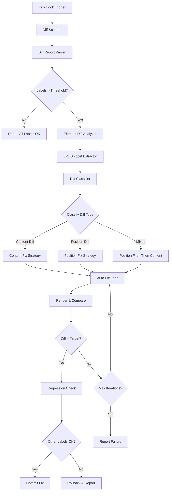
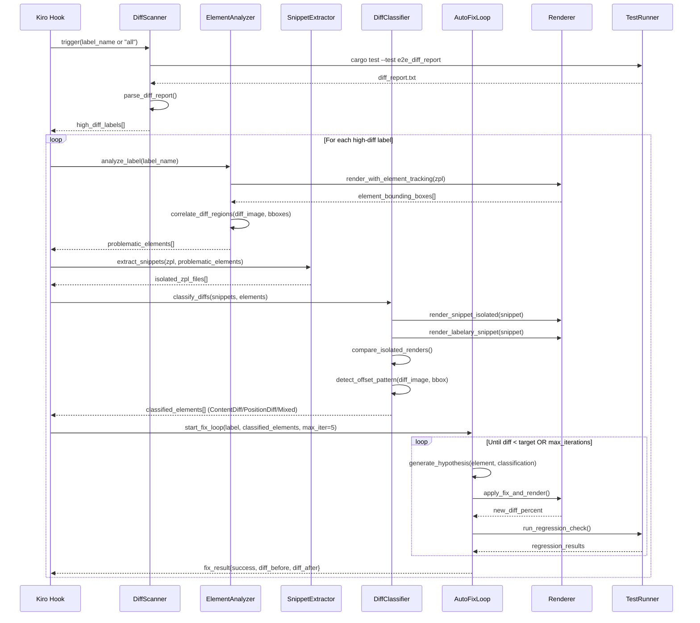
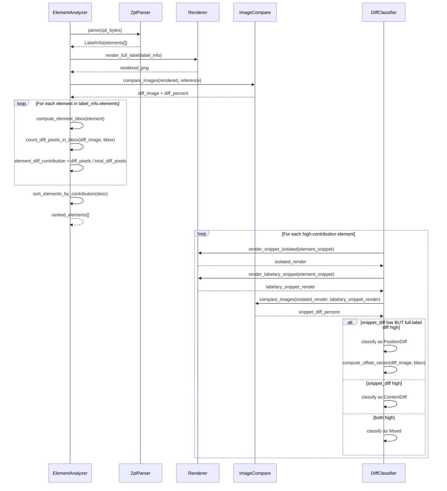

# Design Document: ZPL Diff Auto-Fix Skill

## Overview

The ZPL Diff Auto-Fix Skill is an automated agent workflow for the Labelize project that detects labels with high rendering diff percentages compared to Labelary reference images, isolates the problematic ZPL commands into standalone test files, and iteratively fixes the rendering logic until the diff drops below a target threshold (default 1%).

The skill operates as a Kiro hook/agent workflow that integrates with the existing e2e golden test infrastructure. It automates the tedious manual cycle of: run diff report → identify high-diff regions → isolate ZPL snippets → modify rendering code → re-run tests → check results. The workflow is designed to be safe — it operates on branches, validates changes don't regress other labels, and provides human review checkpoints before committing.

The core challenge is correlating pixel-level diff regions back to specific ZPL commands. Since ZPL is a sequential command language where each command places an element at absolute coordinates, we can map diff "hot zones" in the image back to the bounding boxes of individual rendered elements. This spatial correlation is the key insight that makes automated isolation and fixing possible.

A critical distinction in the analysis is classifying each element's diff into **Content Diff** (元素本身差异) vs **Position Diff** (位置差异). Content diffs mean the element renders differently from the reference — wrong font metrics, incorrect barcode encoding, wrong graphic rendering — but is in the right place. Position diffs mean the element renders correctly but is placed at wrong coordinates — shifted horizontally or vertically from where Labelary places it. These two categories require fundamentally different fix approaches: content diffs target renderer/encoder logic (`src/drawers/`, `src/barcodes/`, `src/elements/`), while position diffs target coordinate calculation in the parser (`src/parsers/zpl_parser.rs`, `src/elements/field_alignment.rs`, `src/elements/drawer_options.rs`). The classification is determined by rendering the element in isolation and comparing it against the Labelary reference for the same snippet — if the isolated renders match but the full-label diff is high, it's a position diff; if the isolated renders themselves differ, it's a content diff.

## Architecture



### Sequence Diagram: Main Auto-Fix Workflow



### Sequence Diagram: Element Diff Analysis & Classification



## Components and Interfaces

### Component 1: DiffScanner

**Purpose**: Runs the e2e diff report and parses results to identify labels exceeding their tolerance thresholds.

```rust
/// Parsed result from a single line of the diff report
#[derive(Debug, Clone)]
pub struct DiffReportEntry {
    pub label_name: String,
    pub extension: String,
    pub diff_percent: f64,
    pub tolerance: f64,
    pub status: DiffStatus,
}

#[derive(Debug, Clone, PartialEq)]
pub enum DiffStatus {
    Perfect,
    Good,
    Minor,
    Moderate,
    High,
    Skip,
    Error,
}

/// Scans the diff report and identifies labels needing fixes
pub trait DiffScanner {
    /// Run the full diff report and return all entries
    fn scan_all(&self) -> Result<Vec<DiffReportEntry>, ScanError>;

    /// Return only labels where diff_percent > tolerance
    fn find_high_diff_labels(&self) -> Result<Vec<DiffReportEntry>, ScanError>;

    /// Scan a single label by name
    fn scan_label(&self, name: &str) -> Result<DiffReportEntry, ScanError>;
}
```

**Responsibilities**:
- Execute `cargo test --test e2e_diff_report -- --nocapture` and capture output
- Parse `testdata/diffs/diff_report.txt` into structured entries
- Cross-reference with `docs/DIFF_THRESHOLDS.md` for per-label tolerances
- Filter labels that exceed their tolerance ceiling

### Component 2: ElementAnalyzer

**Purpose**: For a given high-diff label, determines which ZPL elements contribute most to the pixel diff by correlating diff regions with element bounding boxes.

```rust
/// Bounding box of a rendered element on the canvas
#[derive(Debug, Clone)]
pub struct ElementBBox {
    pub x: i32,
    pub y: i32,
    pub width: i32,
    pub height: i32,
    pub element_index: usize,
    pub element_type: ElementType,
    pub zpl_command: String,
}

#[derive(Debug, Clone)]
pub enum ElementType {
    Text,
    GraphicBox,
    GraphicCircle,
    DiagonalLine,
    GraphicField,
    Barcode128,
    BarcodeEan13,
    Barcode2of5,
    Barcode39,
    BarcodePdf417,
    BarcodeAztec,
    BarcodeDatamatrix,
    BarcodeQr,
    Maxicode,
}

/// Analysis result for a single element's contribution to the diff
#[derive(Debug, Clone)]
pub struct ElementDiffContribution {
    pub bbox: ElementBBox,
    pub diff_pixels_in_bbox: u64,
    pub total_pixels_in_bbox: u64,
    pub local_diff_percent: f64,
    pub contribution_to_total: f64,
    pub classification: Option<DiffClassification>,
}

/// Classification of an element's diff into content vs position categories.
///
/// Determined by rendering the element in isolation and comparing against
/// the Labelary reference for the same snippet:
/// - If isolated renders match well but full-label diff is high → PositionDiff
/// - If isolated renders themselves differ significantly → ContentDiff
/// - If both isolated and positional diffs are significant → Mixed
#[derive(Debug, Clone, PartialEq, Eq)]
pub enum DiffClassification {
    /// Element renders differently from reference — wrong font metrics,
    /// incorrect barcode encoding, wrong graphic rendering.
    /// Fix approach: modify renderer/encoder logic.
    /// Target files: src/drawers/renderer.rs, src/barcodes/*.rs, src/elements/*.rs
    ContentDiff,

    /// Element renders correctly but is placed at wrong coordinates —
    /// shifted horizontally or vertically from Labelary placement.
    /// Fix approach: modify parser coordinate calculation.
    /// Target files: src/parsers/zpl_parser.rs, src/elements/field_alignment.rs,
    ///               src/elements/drawer_options.rs
    PositionDiff,

    /// Both content and position differences detected.
    /// Fix strategy: try position fix first (usually easier), then content fix.
    Mixed,
}

/// Detailed position offset information for PositionDiff elements.
#[derive(Debug, Clone)]
pub struct PositionOffsetInfo {
    pub dx: i32,           // Horizontal offset in pixels (positive = shifted right)
    pub dy: i32,           // Vertical offset in pixels (positive = shifted down)
    pub confidence: f64,   // Confidence of the offset detection [0.0, 1.0]
    pub method: OffsetDetectionMethod,
}

#[derive(Debug, Clone, PartialEq, Eq)]
pub enum OffsetDetectionMethod {
    CrossCorrelation,   // Template matching via cross-correlation
    CentroidShift,      // Centroid of diff pixels vs expected center
    ShadowDetection,    // Element appears twice (original + shifted) in diff
}

pub trait ElementAnalyzer {
    /// Analyze a label and return elements ranked by diff contribution
    fn analyze(
        &self,
        label_name: &str,
        zpl_content: &str,
    ) -> Result<Vec<ElementDiffContribution>, AnalyzeError>;

    /// Compute bounding boxes for all elements in a label
    fn compute_bounding_boxes(
        &self,
        label: &LabelInfo,
    ) -> Vec<ElementBBox>;

    /// Correlate diff image pixels with element bounding boxes
    fn correlate_diff_regions(
        &self,
        diff_image: &RgbaImage,
        bboxes: &[ElementBBox],
    ) -> Vec<ElementDiffContribution>;

    /// Classify each element's diff as ContentDiff, PositionDiff, or Mixed.
    /// Requires snippet extraction and isolated rendering against Labelary.
    fn classify_diffs(
        &self,
        contributions: &mut [ElementDiffContribution],
        snippets: &[ZplSnippet],
        snippet_threshold: f64,  // Max snippet diff% to consider "matching" (default: 2.0)
    ) -> Result<(), AnalyzeError>;

    /// Detect the position offset vector for a PositionDiff element
    /// using cross-correlation or centroid analysis.
    fn detect_offset(
        &self,
        diff_image: &RgbaImage,
        bbox: &ElementBBox,
        isolated_render: &RgbaImage,
    ) -> Option<PositionOffsetInfo>;
}
```

**Responsibilities**:
- Parse ZPL and extract element positions/dimensions from `LabelInfo`
- Compute bounding boxes for each element type (text uses font metrics, barcodes use encoded dimensions, graphics use explicit dimensions)
- Load the diff image from `testdata/diffs/{name}_diff.png`
- Count red diff pixels within each element's bounding box
- Rank elements by their contribution to the total diff
- **Classify each element's diff** as ContentDiff, PositionDiff, or Mixed by comparing isolated snippet renders against Labelary snippet references
- **Detect position offset vectors** for PositionDiff elements using cross-correlation or centroid analysis
- Provide classification-aware analysis reports

### Component 3: SnippetExtractor

**Purpose**: Extracts problematic ZPL commands into standalone ZPL files that can be rendered and tested in isolation.

```rust
/// A standalone ZPL snippet for isolated testing
#[derive(Debug, Clone)]
pub struct ZplSnippet {
    pub label_name: String,
    pub element_index: usize,
    pub element_type: ElementType,
    pub zpl_content: String,
    pub file_path: PathBuf,
    pub original_diff_percent: f64,
}

pub trait SnippetExtractor {
    /// Extract a single element into a standalone ZPL file
    fn extract_element(
        &self,
        original_zpl: &str,
        element: &ElementDiffContribution,
        label_name: &str,
    ) -> Result<ZplSnippet, ExtractError>;

    /// Extract multiple related elements (e.g., a barcode + its interpretation line)
    fn extract_element_group(
        &self,
        original_zpl: &str,
        elements: &[ElementDiffContribution],
        label_name: &str,
    ) -> Result<ZplSnippet, ExtractError>;
}
```

**Responsibilities**:
- Parse the original ZPL to identify command boundaries
- Extract the relevant `^FO`/`^FT` + config + `^FD` + `^FS` command sequences for each element
- Preserve global state commands (`^CF`, `^BY`, `^CI`, `^LH`, `^PW`) that affect the element
- Wrap extracted commands in `^XA`...`^XZ` to create valid standalone ZPL
- Write snippets to `testdata/snippets/{label_name}_{element_index}.zpl`
- Render the snippet and fetch Labelary reference for comparison
- **Provide isolated snippet renders as the primary signal for diff classification** — the comparison between our isolated render and Labelary's isolated render determines whether the diff is content-based or position-based

### Component 4: AutoFixLoop

**Purpose**: Iteratively applies rendering fixes and validates them against both the isolated snippet and the full label.

```rust
/// Configuration for the auto-fix loop
#[derive(Debug, Clone)]
pub struct FixConfig {
    pub target_diff_percent: f64,   // Default: 1.0
    pub max_iterations: usize,      // Default: 5
    pub regression_tolerance: f64,  // Max allowed regression on other labels (default: 0.5%)
    pub label_name: String,
}

/// Result of a single fix attempt
#[derive(Debug, Clone)]
pub struct FixAttempt {
    pub iteration: usize,
    pub description: String,
    pub file_changed: String,
    pub diff_before: f64,
    pub diff_after: f64,
    pub improved: bool,
    pub regression_labels: Vec<String>,
}

/// Final result of the auto-fix loop
#[derive(Debug, Clone)]
pub struct FixResult {
    pub label_name: String,
    pub success: bool,
    pub initial_diff: f64,
    pub final_diff: f64,
    pub iterations: usize,
    pub attempts: Vec<FixAttempt>,
    pub files_modified: Vec<String>,
}

pub trait AutoFixLoop {
    /// Run the iterative fix loop for a label
    fn run(
        &self,
        config: &FixConfig,
        analysis: &[ElementDiffContribution],
        snippets: &[ZplSnippet],
    ) -> Result<FixResult, FixError>;

    /// Generate a fix hypothesis based on element type, diff classification, and diff pattern
    fn generate_hypothesis(
        &self,
        element: &ElementDiffContribution,
        snippet: &ZplSnippet,
    ) -> FixHypothesis;

    /// Apply a fix and measure the result
    fn apply_and_measure(
        &self,
        hypothesis: &FixHypothesis,
        label_name: &str,
    ) -> Result<FixAttempt, FixError>;

    /// Check that a fix doesn't regress other labels
    fn regression_check(
        &self,
        tolerance: f64,
    ) -> Result<Vec<RegressionEntry>, FixError>;
}

#[derive(Debug, Clone)]
pub struct FixHypothesis {
    pub element_type: ElementType,
    pub classification: DiffClassification,
    pub category: FixCategory,
    pub description: String,
    pub target_file: String,
    pub suggested_change: String,
    pub position_offset: Option<PositionOffsetInfo>,
}

#[derive(Debug, Clone)]
pub enum FixCategory {
    FontMetrics,        // Adjust font scaling, ascent, advance widths (ContentDiff)
    BarcodeEncoding,    // Fix barcode encoder output (ContentDiff)
    PositionOffset,     // Correct element positioning — ^FO/^FT parsing, ^LH offset, baseline (PositionDiff)
    GraphicRendering,   // Fix graphic primitive rendering (ContentDiff)
    CommandParsing,     // Fix ZPL command parameter parsing (PositionDiff)
}
```

**Responsibilities**:
- Orchestrate the fix-test-validate cycle
- **Use diff classification to select the appropriate fix strategy**:
  - ContentDiff → target renderer/encoder logic (FontMetrics, BarcodeEncoding, GraphicRendering)
  - PositionDiff → target coordinate calculation (PositionOffset, CommandParsing)
  - Mixed → try position fix first (usually easier and more impactful), then content fix
- Categorize diff patterns to generate targeted fix hypotheses
- **Leverage position offset vectors** to suggest specific coordinate adjustments for PositionDiff elements
- Apply code changes to the appropriate source files
- Re-render and compare after each change
- Run regression checks against all other golden tests
- Rollback changes that cause regressions
- Report results with before/after diff percentages

### Component 5: SkillOrchestrator

**Purpose**: Top-level coordinator that ties all components together and integrates with Kiro's hook system.

```rust
/// Main entry point for the auto-fix skill
pub struct SkillOrchestrator {
    scanner: Box<dyn DiffScanner>,
    analyzer: Box<dyn ElementAnalyzer>,
    extractor: Box<dyn SnippetExtractor>,
    fixer: Box<dyn AutoFixLoop>,
}

impl SkillOrchestrator {
    /// Run the full auto-fix workflow for a specific label
    pub fn fix_label(&self, label_name: &str) -> Result<FixResult, SkillError>;

    /// Run the full auto-fix workflow for all high-diff labels
    pub fn fix_all_high_diff(&self) -> Result<Vec<FixResult>, SkillError>;

    /// Analyze only (no fixes) — useful for understanding diff sources
    pub fn analyze_label(&self, label_name: &str) -> Result<Vec<ElementDiffContribution>, SkillError>;

    /// Extract snippets only — useful for manual debugging
    pub fn extract_snippets(&self, label_name: &str) -> Result<Vec<ZplSnippet>, SkillError>;
}
```

**Responsibilities**:
- Provide the top-level API for the Kiro hook
- Coordinate the scan → analyze → extract → fix pipeline
- Handle errors and partial failures gracefully
- Generate human-readable reports of actions taken

## Data Models

### Model 1: DiffReport

```rust
/// Complete diff report for all labels
#[derive(Debug, Clone)]
pub struct DiffReport {
    pub entries: Vec<DiffReportEntry>,
    pub generated_at: String,
    pub total_labels: usize,
    pub perfect_count: usize,
    pub good_count: usize,
    pub minor_count: usize,
    pub moderate_count: usize,
    pub high_count: usize,
}
```

**Validation Rules**:
- `entries` must not be empty (at least one label must exist in testdata)
- `diff_percent` must be in range `[0.0, 100.0]`
- `tolerance` must be positive
- Sum of category counts must equal `total_labels`

### Model 2: ZplCommandSpan

```rust
/// A span of ZPL commands that together produce one rendered element
#[derive(Debug, Clone)]
pub struct ZplCommandSpan {
    pub start_offset: usize,       // Byte offset in original ZPL
    pub end_offset: usize,         // Byte offset of ^FS end
    pub commands: Vec<ZplCommand>,  // Individual commands in this span
    pub element_index: usize,       // Index in LabelInfo.elements
}

#[derive(Debug, Clone)]
pub struct ZplCommand {
    pub prefix: String,    // e.g., "^FO", "^A", "^BC", "^FD"
    pub raw_text: String,  // Full command text
    pub offset: usize,     // Byte offset in original ZPL
}
```

**Validation Rules**:
- `start_offset < end_offset`
- `commands` must contain at least one command
- Every span must end with a `^FS` command (or be a standalone graphic command)

### Model 3: DiffHeatmap

```rust
/// Spatial diff analysis for a label image
#[derive(Debug, Clone)]
pub struct DiffHeatmap {
    pub width: u32,
    pub height: u32,
    pub total_diff_pixels: u64,
    pub regions: Vec<DiffRegion>,
}

#[derive(Debug, Clone)]
pub struct DiffRegion {
    pub bbox: ElementBBox,
    pub diff_pixel_count: u64,
    pub density: f64,  // diff_pixels / total_pixels_in_region
}
```

**Validation Rules**:
- `width` and `height` must match the label canvas dimensions (typically 813×1626)
- `density` must be in range `[0.0, 1.0]`
- Sum of all region `diff_pixel_count` may exceed `total_diff_pixels` (overlapping bboxes)

## Algorithmic Pseudocode

### Main Processing Algorithm: Element Bounding Box Computation

```rust
/// Compute the bounding box for a rendered element.
/// Each element type has different sizing logic.
fn compute_element_bbox(element: &LabelElement, options: &DrawerOptions) -> Option<ElementBBox> {
    match element {
        LabelElement::Text(text) => {
            let font_size = text.font.get_size() as f32;
            let scale_x = text.font.get_scale_x() as f32;
            let text_width = measure_text_width(&text.text, font_size, scale_x);
            let (w, h) = if let Some(ref block) = text.block {
                let line_height = font_size * (1.0 + block.line_spacing as f32 / font_size);
                (block.max_width as f32, block.max_lines as f32 * line_height)
            } else {
                (text_width, font_size)
            };
            // Swap w/h for rotated orientations
            let (w, h) = match text.font.orientation {
                FieldOrientation::Rotated90 | FieldOrientation::Rotated270 => (h, w),
                _ => (w, h),
            };
            Some(ElementBBox {
                x: text.position.x,
                y: text.position.y,
                width: w.ceil() as i32,
                height: h.ceil() as i32,
                element_type: ElementType::Text,
                ..
            })
        }
        LabelElement::GraphicBox(gb) => Some(ElementBBox {
            x: gb.position.x,
            y: gb.position.y,
            width: gb.width.max(gb.border_thickness),
            height: gb.height.max(gb.border_thickness),
            element_type: ElementType::GraphicBox,
            ..
        }),
        LabelElement::Barcode128(bc) => {
            // Width depends on encoded data length and module width
            // Height is explicit from ^BC command
            Some(ElementBBox {
                x: bc.position.x,
                y: bc.position.y,
                width: estimate_barcode128_width(&bc.data, bc.width),
                height: bc.barcode.height,
                element_type: ElementType::Barcode128,
                ..
            })
        }
        // Similar patterns for other element types...
        _ => None,
    }
}
```

**Preconditions:**
- `element` is a drawable element (not a Config or Template variant)
- `options` contains valid label dimensions and dpmm

**Postconditions:**
- Returns `Some(bbox)` for all drawable element types
- `bbox.width > 0` and `bbox.height > 0`
- `bbox.x` and `bbox.y` are within canvas bounds (may extend beyond for clipped elements)

**Loop Invariants:** N/A (no loops in this function)

### Diff Correlation Algorithm

```rust
/// Correlate diff pixels with element bounding boxes to determine
/// which elements contribute most to the rendering difference.
///
/// ALGORITHM correlate_diff_regions
/// INPUT: diff_image (RgbaImage where red pixels = differences),
///        bboxes (element bounding boxes)
/// OUTPUT: contributions sorted by diff contribution descending
fn correlate_diff_regions(
    diff_image: &RgbaImage,
    bboxes: &[ElementBBox],
) -> Vec<ElementDiffContribution> {
    // Step 1: Count total diff pixels in the image
    let total_diff_pixels = count_red_pixels(diff_image);
    if total_diff_pixels == 0 {
        return vec![];  // No differences to attribute
    }

    // Step 2: For each element bbox, count diff pixels within it
    let mut contributions = Vec::with_capacity(bboxes.len());
    for bbox in bboxes {
        let diff_in_bbox = count_red_pixels_in_rect(
            diff_image,
            bbox.x, bbox.y,
            bbox.x + bbox.width, bbox.y + bbox.height,
        );
        let total_in_bbox = (bbox.width as u64) * (bbox.height as u64);
        let local_diff = if total_in_bbox > 0 {
            diff_in_bbox as f64 / total_in_bbox as f64
        } else {
            0.0
        };
        let contribution = diff_in_bbox as f64 / total_diff_pixels as f64;

        contributions.push(ElementDiffContribution {
            bbox: bbox.clone(),
            diff_pixels_in_bbox: diff_in_bbox,
            total_pixels_in_bbox: total_in_bbox,
            local_diff_percent: local_diff * 100.0,
            contribution_to_total: contribution * 100.0,
        });
    }

    // Step 3: Sort by contribution descending
    contributions.sort_by(|a, b| {
        b.contribution_to_total
            .partial_cmp(&a.contribution_to_total)
            .unwrap_or(std::cmp::Ordering::Equal)
    });

    contributions
}

fn count_red_pixels(img: &RgbaImage) -> u64 {
    img.pixels()
        .filter(|p| p[0] > 200 && p[1] < 50 && p[2] < 50 && p[3] > 200)
        .count() as u64
}

fn count_red_pixels_in_rect(
    img: &RgbaImage,
    x1: i32, y1: i32, x2: i32, y2: i32,
) -> u64 {
    let mut count = 0u64;
    let x1 = x1.max(0) as u32;
    let y1 = y1.max(0) as u32;
    let x2 = (x2 as u32).min(img.width());
    let y2 = (y2 as u32).min(img.height());
    for y in y1..y2 {
        for x in x1..x2 {
            let p = img.get_pixel(x, y);
            if p[0] > 200 && p[1] < 50 && p[2] < 50 && p[3] > 200 {
                count += 1;
            }
        }
    }
    count
}
```

**Preconditions:**
- `diff_image` is a valid RGBA image where red pixels (R>200, G<50, B<50) indicate differences
- `bboxes` contains valid bounding boxes with non-negative dimensions
- The diff image and bboxes refer to the same label rendering

**Postconditions:**
- Returns contributions sorted by `contribution_to_total` descending
- `contribution_to_total` values are in range `[0.0, 100.0]`
- Sum of all `contribution_to_total` may exceed 100% due to overlapping bboxes
- Empty result if `total_diff_pixels == 0`

**Loop Invariants:**
- For the bbox iteration: all previously processed bboxes have valid contribution values
- For pixel counting: `count` is always ≤ total pixels in the rect

### Diff Classification Algorithm

```rust
/// Classify each element's diff as ContentDiff, PositionDiff, or Mixed.
///
/// ALGORITHM classify_element_diffs
/// INPUT: contributions (element diff contributions with snippets),
///        snippet_threshold (max snippet diff% to consider "matching", default 2.0)
/// OUTPUT: contributions with classification field populated
///
/// The key insight: render the element in isolation and compare against
/// Labelary's render of the same isolated snippet.
/// - If isolated renders match → element is correct, but misplaced → PositionDiff
/// - If isolated renders differ → element rendering is wrong → ContentDiff
/// - If both → Mixed
fn classify_element_diffs(
    contributions: &mut [ElementDiffContribution],
    snippets: &[ZplSnippet],
    snippet_threshold: f64,  // default: 2.0%
) -> Result<(), AnalyzeError> {
    for (i, contrib) in contributions.iter_mut().enumerate() {
        if contrib.diff_pixels_in_bbox == 0 {
            // No diff pixels — no classification needed
            contrib.classification = None;
            continue;
        }

        let snippet = &snippets[i];

        // Step 1: Render the snippet in isolation using our renderer
        let our_render = render_snippet_isolated(&snippet.zpl_content)?;

        // Step 2: Render the same snippet via Labelary API
        let labelary_render = fetch_labelary_render(&snippet.zpl_content)?;

        // Step 3: Compare the two isolated renders
        let snippet_diff = compare_images(&our_render, &labelary_render)?;

        // Step 4: Classify based on snippet diff vs full-label diff
        let has_content_diff = snippet_diff.diff_percent > snippet_threshold;
        let has_position_diff = !has_content_diff && contrib.local_diff_percent > snippet_threshold;

        contrib.classification = Some(if has_content_diff && has_position_diff {
            DiffClassification::Mixed
        } else if has_content_diff {
            DiffClassification::ContentDiff
        } else if has_position_diff {
            DiffClassification::PositionDiff
        } else {
            // Both diffs are low — might be noise or sub-threshold
            DiffClassification::ContentDiff  // default to content
        });
    }
    Ok(())
}

/// Detect the position offset vector for a PositionDiff element.
///
/// ALGORITHM detect_position_offset
/// INPUT: diff_image (full label diff), bbox (element bounding box),
///        isolated_render (our isolated render of the element)
/// OUTPUT: PositionOffsetInfo with dx, dy offset and confidence
///
/// Uses three methods in priority order:
/// 1. Shadow detection: if diff shows element appearing twice (offset), strong signal
/// 2. Cross-correlation: template match the isolated render against the reference
/// 3. Centroid shift: compute centroid of diff pixels vs expected center
fn detect_position_offset(
    diff_image: &RgbaImage,
    bbox: &ElementBBox,
    isolated_render: &RgbaImage,
    reference_image: &RgbaImage,
) -> Option<PositionOffsetInfo> {
    // Method 1: Shadow detection
    // Look for a "double image" pattern in the diff region — the element
    // appears at both the correct and incorrect positions, creating a shadow.
    let shadow = detect_shadow_pattern(diff_image, bbox);
    if let Some((dx, dy, confidence)) = shadow {
        if confidence > 0.7 {
            return Some(PositionOffsetInfo {
                dx, dy, confidence,
                method: OffsetDetectionMethod::ShadowDetection,
            });
        }
    }

    // Method 2: Cross-correlation / template matching
    // Search for the isolated render within a neighborhood of the expected position
    // in the reference image to find where it actually appears.
    let search_radius = 20; // pixels
    let correlation = template_match(
        reference_image,
        isolated_render,
        bbox.x, bbox.y,
        search_radius,
    );
    if let Some((best_x, best_y, confidence)) = correlation {
        let dx = best_x - bbox.x;
        let dy = best_y - bbox.y;
        if (dx != 0 || dy != 0) && confidence > 0.5 {
            return Some(PositionOffsetInfo {
                dx, dy, confidence,
                method: OffsetDetectionMethod::CrossCorrelation,
            });
        }
    }

    // Method 3: Centroid shift
    // Compute the centroid of diff pixels in the bbox region and compare
    // to the expected center of the element.
    let diff_centroid = compute_diff_centroid(diff_image, bbox);
    let expected_center = (
        bbox.x + bbox.width / 2,
        bbox.y + bbox.height / 2,
    );
    let dx = diff_centroid.0 - expected_center.0;
    let dy = diff_centroid.1 - expected_center.1;
    if dx.abs() > 2 || dy.abs() > 2 {
        return Some(PositionOffsetInfo {
            dx, dy,
            confidence: 0.3,  // Lower confidence for centroid method
            method: OffsetDetectionMethod::CentroidShift,
        });
    }

    None  // No significant offset detected
}
```

**Preconditions (classify_element_diffs):**
- `contributions` and `snippets` have the same length
- Each snippet contains valid standalone ZPL that renders the corresponding element
- `snippet_threshold > 0.0`

**Postconditions (classify_element_diffs):**
- Every contribution with `diff_pixels_in_bbox > 0` has `classification = Some(...)`
- Contributions with zero diff pixels have `classification = None`
- Classification is deterministic for the same inputs

**Preconditions (detect_position_offset):**
- `diff_image` and `reference_image` have the same dimensions
- `bbox` is within the image bounds
- `isolated_render` is a valid render of the element

**Postconditions (detect_position_offset):**
- Returns `Some(info)` only if a significant offset is detected (|dx| > 2 or |dy| > 2)
- `confidence` is in range `[0.0, 1.0]`
- `method` indicates which detection algorithm produced the result

### ZPL Snippet Extraction Algorithm

```rust
/// Extract a standalone ZPL file for a specific element.
///
/// ALGORITHM extract_element_snippet
/// INPUT: original_zpl (full ZPL string), element (the problematic element),
///        label_name (for file naming)
/// OUTPUT: ZplSnippet with standalone ZPL content
fn extract_element_snippet(
    original_zpl: &str,
    element: &ElementDiffContribution,
    label_name: &str,
) -> Result<ZplSnippet, ExtractError> {
    // Step 1: Parse the ZPL into command spans
    let commands = split_zpl_commands(original_zpl.as_bytes())?;
    let spans = group_commands_into_spans(&commands);

    // Step 2: Identify global state commands that affect this element
    let global_commands = extract_global_state_commands(&commands);
    // Global commands: ^LH, ^PW, ^CF, ^BY, ^CI, ^FW, ^PO, ^LR

    // Step 3: Find the command span for the target element
    let target_span = &spans[element.bbox.element_index];

    // Step 4: Build standalone ZPL
    let mut snippet = String::from("^XA\n");

    // Include relevant global state
    for cmd in &global_commands {
        snippet.push_str(&cmd.raw_text);
        snippet.push('\n');
    }

    // Include the element's commands
    for cmd in &target_span.commands {
        snippet.push_str(&cmd.raw_text);
        snippet.push('\n');
    }

    snippet.push_str("^XZ\n");

    // Step 5: Write to file
    let file_path = PathBuf::from(format!(
        "testdata/snippets/{}_{}.zpl",
        label_name, element.bbox.element_index
    ));
    std::fs::create_dir_all(file_path.parent().unwrap())?;
    std::fs::write(&file_path, &snippet)?;

    Ok(ZplSnippet {
        label_name: label_name.to_string(),
        element_index: element.bbox.element_index,
        element_type: element.bbox.element_type.clone(),
        zpl_content: snippet,
        file_path,
        original_diff_percent: element.local_diff_percent,
    })
}
```

**Preconditions:**
- `original_zpl` is valid ZPL (starts with `^XA`, ends with `^XZ`)
- `element.bbox.element_index` is a valid index into the parsed elements
- `label_name` is a valid filesystem-safe string

**Postconditions:**
- Returns a `ZplSnippet` with valid standalone ZPL content
- The snippet ZPL starts with `^XA` and ends with `^XZ`
- The snippet file is written to `testdata/snippets/`
- The snippet renders the target element in isolation with correct global state

### Auto-Fix Loop Algorithm

```rust
/// Run the iterative fix loop for a single label.
///
/// ALGORITHM auto_fix_loop
/// INPUT: config (fix parameters), analysis (element contributions),
///        snippets (isolated ZPL files)
/// OUTPUT: FixResult with success/failure and all attempts
fn auto_fix_loop(
    config: &FixConfig,
    analysis: &[ElementDiffContribution],
    snippets: &[ZplSnippet],
) -> Result<FixResult, FixError> {
    let initial_diff = scan_label(&config.label_name)?.diff_percent;
    let mut current_diff = initial_diff;
    let mut attempts = Vec::new();
    let mut files_modified = Vec::new();

    // Process elements in order of highest contribution first
    for (i, element) in analysis.iter().enumerate() {
        if current_diff <= config.target_diff_percent {
            break;  // Already below target
        }
        if attempts.len() >= config.max_iterations {
            break;  // Max iterations reached
        }

        // Generate fix hypothesis based on element type, classification, and diff pattern
        let hypothesis = generate_hypothesis(element, &snippets[i]);

        // Save current state for potential rollback
        let backup = backup_file(&hypothesis.target_file)?;

        // Apply the fix
        apply_fix(&hypothesis)?;

        // Re-render and measure
        let new_diff = scan_label(&config.label_name)?.diff_percent;

        // Check for regressions
        let regressions = regression_check(config.regression_tolerance)?;

        let attempt = FixAttempt {
            iteration: attempts.len() + 1,
            description: hypothesis.description.clone(),
            file_changed: hypothesis.target_file.clone(),
            diff_before: current_diff,
            diff_after: new_diff,
            improved: new_diff < current_diff,
            regression_labels: regressions.iter().map(|r| r.label_name.clone()).collect(),
        };

        if new_diff < current_diff && regressions.is_empty() {
            // Fix improved things without regressions — keep it
            current_diff = new_diff;
            files_modified.push(hypothesis.target_file.clone());
        } else {
            // Fix didn't help or caused regressions — rollback
            restore_file(&hypothesis.target_file, &backup)?;
        }

        attempts.push(attempt);
    }

    Ok(FixResult {
        label_name: config.label_name.clone(),
        success: current_diff <= config.target_diff_percent,
        initial_diff,
        final_diff: current_diff,
        iterations: attempts.len(),
        attempts,
        files_modified,
    })
}
```

**Preconditions:**
- `config.target_diff_percent > 0.0`
- `config.max_iterations > 0`
- `analysis` and `snippets` have the same length
- All referenced source files exist and are writable

**Postconditions:**
- `result.final_diff <= result.initial_diff` (never makes things worse)
- If `result.success`, then `result.final_diff <= config.target_diff_percent`
- All rollbacks are applied for failed attempts (no partial state)
- `result.files_modified` contains only files from successful attempts

**Loop Invariants:**
- `current_diff <= initial_diff` (monotonically non-increasing)
- All previous rollbacks have been applied for failed attempts
- `attempts.len() <= config.max_iterations`

## Key Functions with Formal Specifications

### Function 1: parse_diff_report()

```rust
fn parse_diff_report(report_text: &str) -> Result<DiffReport, ParseError>
```

**Preconditions:**
- `report_text` is the content of `testdata/diffs/diff_report.txt`
- The report follows the table format produced by `e2e_diff_report.rs`

**Postconditions:**
- Returns a `DiffReport` with one entry per label in the report
- Each entry has a valid `diff_percent` in `[0.0, 100.0]` or `-1.0` for skipped/errored
- Category counts sum to `total_labels`

### Function 2: group_commands_into_spans()

```rust
fn group_commands_into_spans(commands: &[&str]) -> Vec<ZplCommandSpan>
```

**Preconditions:**
- `commands` is the output of `split_zpl_commands()` — individual ZPL commands
- Commands are in order as they appear in the ZPL source

**Postconditions:**
- Each span groups commands from a position command (`^FO`/`^FT`) through `^FS`
- Spans are in the same order as elements in `LabelInfo.elements`
- Global state commands (`^CF`, `^BY`, etc.) are not included in spans
- Every drawable element has exactly one corresponding span

### Function 3: generate_hypothesis()

```rust
fn generate_hypothesis(
    element: &ElementDiffContribution,
    snippet: &ZplSnippet,
) -> FixHypothesis
```

**Preconditions:**
- `element` has a valid `element_type` and non-zero `diff_pixels_in_bbox`
- `element.classification` is `Some(...)` (diff has been classified)
- `snippet` contains valid standalone ZPL that renders the element

**Postconditions:**
- Returns a `FixHypothesis` with a valid `target_file` path
- `classification` matches the element's diff classification
- `category` is determined by **both** element type and diff classification:
  - ContentDiff + Text → FontMetrics, target: `src/drawers/renderer.rs`
  - ContentDiff + Barcode → BarcodeEncoding, target: `src/barcodes/*.rs`
  - ContentDiff + Graphic → GraphicRendering, target: `src/drawers/renderer.rs`
  - PositionDiff (any type) → PositionOffset, target: `src/parsers/zpl_parser.rs`
  - PositionDiff (alignment) → CommandParsing, target: `src/elements/field_alignment.rs`
  - Mixed → PositionOffset first (try position fix before content fix)
- `suggested_change` is a human-readable description of the proposed fix
- `target_file` points to an existing source file in `src/`
- For PositionDiff, `position_offset` contains the detected offset vector if available

### Function 4: regression_check()

```rust
fn regression_check(tolerance: f64) -> Result<Vec<RegressionEntry>, FixError>
```

**Preconditions:**
- `tolerance >= 0.0` (maximum allowed diff increase on any label)
- The project builds successfully (`cargo build` passes)

**Postconditions:**
- Returns empty vec if no label's diff increased by more than `tolerance`
- Each `RegressionEntry` contains the label name, old diff, new diff, and delta
- Only labels whose diff increased beyond tolerance are included

## Example Usage

```rust
// Example 1: Analyze a specific label's diff sources
let orchestrator = SkillOrchestrator::new();
let analysis = orchestrator.analyze_label("fedex")?;
for contrib in &analysis {
    println!(
        "Element {} ({:?}) at ({},{}) contributes {:.1}% of total diff",
        contrib.bbox.element_index,
        contrib.bbox.element_type,
        contrib.bbox.x, contrib.bbox.y,
        contrib.contribution_to_total,
    );
}

// Example 2: Extract isolated snippets for debugging
let snippets = orchestrator.extract_snippets("fedex")?;
for snippet in &snippets {
    println!(
        "Snippet written to {} (element {} - {:?}, local diff {:.1}%)",
        snippet.file_path.display(),
        snippet.element_index,
        snippet.element_type,
        snippet.original_diff_percent,
    );
}

// Example 3: Run the full auto-fix loop
let result = orchestrator.fix_label("fedex")?;
println!(
    "Fix {}: {} → {:.2}% (was {:.2}%), {} iterations, {} files changed",
    if result.success { "SUCCEEDED" } else { "FAILED" },
    result.label_name,
    result.final_diff,
    result.initial_diff,
    result.iterations,
    result.files_modified.len(),
);

// Example 4: Fix all high-diff labels
let results = orchestrator.fix_all_high_diff()?;
for result in &results {
    println!(
        "{}: {:.2}% → {:.2}% ({})",
        result.label_name,
        result.initial_diff,
        result.final_diff,
        if result.success { "OK" } else { "NEEDS MANUAL" },
    );
}

// Example 5: Kiro hook integration — triggered manually
// The skill is invoked via a userTriggered hook:
//   Event: userTriggered
//   Action: askAgent
//   Prompt: "Run the ZPL diff auto-fix skill for the label: {label_name}"
```

## Correctness Properties

*A property is a characteristic or behavior that should hold true across all valid executions of a system — essentially, a formal statement about what the system should do. Properties serve as the bridge between human-readable specifications and machine-verifiable correctness guarantees.*

### Property 1: Diff report parsing round-trip

*For any* valid DiffReportEntry (with label name, extension, diff percentage in [0.0, 100.0], tolerance, and status), formatting it as a diff report line and then parsing that line back SHALL produce an equivalent DiffReportEntry with all fields matching the original.

**Validates: Requirements 1.1, 1.2, 1.7**

### Property 2: Status classification correctness

*For any* diff percentage in [0.0, 100.0], the DiffScanner SHALL classify it into exactly one status category following the documented ranges: Perfect for 0%, Good for (0%, 1%), Minor for [1%, 5%), Moderate for [5%, 15%), and High for [15%, 100%].

**Validates: Requirement 1.3**

### Property 3: High-diff filter precision

*For any* set of DiffReportEntries, filtering for high-diff labels SHALL return exactly those entries where diff_percent exceeds the entry's tolerance — every returned entry has diff_percent > tolerance, and no excluded entry has diff_percent > tolerance.

**Validates: Requirement 1.4**

### Property 4: Label not found for absent names

*For any* diff report and any label name not present in the report, scanning for that label SHALL return a LabelNotFound error containing the complete list of available label names.

**Validates: Requirements 1.6, 8.1**

### Property 5: Bounding box positive dimensions

*For any* drawable element (Text with positive font size, GraphicBox with positive dimensions, any barcode type with valid data), compute_element_bbox SHALL return a bounding box with width > 0 and height > 0.

**Validates: Requirements 2.2, 9.5**

### Property 6: Diff correlation correctness

*For any* RGBA image with known red pixel positions and any set of non-overlapping bounding boxes, the sum of diff_pixels_in_bbox across all boxes SHALL be less than or equal to the total red pixel count in the image. Additionally, each element's local_diff_percent SHALL equal (diff_pixels_in_bbox / total_pixels_in_bbox) × 100 and contribution_to_total SHALL equal (diff_pixels_in_bbox / total_diff_pixels) × 100.

**Validates: Requirements 2.3, 2.4**

### Property 7: Contribution sorting invariant

*For any* analysis result from the ElementAnalyzer, the returned ElementDiffContribution list SHALL be sorted in descending order of contribution_to_total — each element's contribution is greater than or equal to the next element's contribution.

**Validates: Requirement 2.5**

### Property 8: Snippet structural validity

*For any* extracted ZplSnippet, the zpl_content SHALL start with `^XA` and end with `^XZ`, forming valid standalone ZPL.

**Validates: Requirement 3.3**

### Property 9: Span-element correspondence

*For any* valid ZPL input that parses into a LabelInfo with N drawable elements, group_commands_into_spans SHALL produce exactly N spans, one per drawable element, in the same order as LabelInfo.elements.

**Validates: Requirement 3.6**

### Property 10: Monotonic improvement

*For any* sequence of fix attempts in the AutoFixLoop, the final diff percentage for the target label SHALL be less than or equal to the initial diff percentage. The loop never makes a label's diff worse.

**Validates: Requirement 4.7**

### Property 11: Fix category mapping consistency

*For any* ElementDiffContribution with a DiffClassification, the generated FixHypothesis category SHALL be determined by **both** the element type and the diff classification: ContentDiff + Text maps to FontMetrics, ContentDiff + barcode types maps to BarcodeEncoding, ContentDiff + graphic types maps to GraphicRendering, PositionDiff (any element type) maps to PositionOffset or CommandParsing, and Mixed maps to PositionOffset first.

**Validates: Requirements 4.8, 10.1, 10.2**

### Property 11a: Diff classification correctness

*For any* element where the isolated snippet render matches the Labelary snippet render within the snippet threshold, AND the full-label diff for that element's bbox is above the threshold, the classification SHALL be PositionDiff. *For any* element where the isolated snippet render differs significantly from the Labelary snippet render, the classification SHALL be ContentDiff or Mixed.

**Validates: Requirements 10.1, 10.2, 10.3**

### Property 11b: Position offset detection consistency

*For any* element classified as PositionDiff, if a position offset is detected with confidence > 0.5, applying the inverse offset to the element's coordinates SHALL reduce the diff contribution for that element.

**Validates: Requirement 10.5**

### Property 12: Regression detection precision

*For any* set of before/after diff percentage pairs and a regression tolerance, the regression check SHALL flag exactly those labels where (after_diff - before_diff) exceeds the tolerance — no false positives and no false negatives.

**Validates: Requirement 5.2**

### Property 13: Rollback completeness

*For any* file modified by a fix attempt, after rollback the file content SHALL be byte-identical to its pre-change state, and the label's diff percentage SHALL equal the value before the attempt was applied (within floating-point epsilon).

**Validates: Requirements 5.4, 4.3, 4.4**

### Property 14: Edit distance suggestion correctness

*For any* set of available label names and a query string not in the set, the suggested closest match SHALL be the label name with the minimum edit distance to the query.

**Validates: Requirement 8.1**

### Property 15: Data model invariants

*For any* valid DiffReport, the sum of category counts (perfect + good + minor + moderate + high) SHALL equal total_labels. *For any* ZplCommandSpan, start_offset SHALL be less than end_offset and the span SHALL contain at least one command. *For any* DiffHeatmap region, density SHALL be in [0.0, 1.0].

**Validates: Requirements 9.1, 9.3, 9.4**

## Error Handling

### Error Scenario 1: Label Not Found

**Condition**: User requests analysis of a label name that doesn't exist in `testdata/`
**Response**: Return `SkillError::LabelNotFound { name }` with a list of available labels
**Recovery**: Suggest the closest matching label name using edit distance

### Error Scenario 2: Labelary API Unavailable

**Condition**: Cannot fetch reference image from Labelary for a new snippet
**Response**: Fall back to the cached reference image if available; otherwise skip snippet comparison
**Recovery**: Use the existing `testdata/labelary_cache/` directory; log a warning and continue with full-label comparison only

### Error Scenario 3: Build Failure After Fix

**Condition**: A code change introduced by the auto-fix loop causes `cargo build` to fail
**Response**: Immediately rollback the change and mark the attempt as failed
**Recovery**: Restore the backed-up file, verify the build passes, then continue to the next hypothesis

### Error Scenario 4: Regression Detected

**Condition**: A fix improves the target label but worsens another label beyond tolerance
**Response**: Rollback the fix, record the regression details in the attempt log
**Recovery**: Try an alternative fix hypothesis if available; otherwise report the conflict to the user

### Error Scenario 5: Max Iterations Exhausted

**Condition**: The fix loop reaches `max_iterations` without achieving the target diff
**Response**: Return `FixResult { success: false, ... }` with all attempt details
**Recovery**: Present the analysis and partial improvements to the user for manual intervention

## Testing Strategy

### Unit Testing Approach

- **DiffReport parsing**: Test with sample report text, verify correct extraction of all fields
- **Bounding box computation**: Test each element type with known positions and dimensions
- **Diff correlation**: Test with synthetic diff images (known red pixel patterns) and known bboxes
- **ZPL command grouping**: Test with various ZPL structures (simple, nested templates, stored formats)
- **Snippet extraction**: Verify extracted ZPL is valid and renders correctly

### Property-Based Testing Approach

**Property Test Library**: `proptest` (already a dev-dependency)

- **Bounding box non-negative**: For any valid `LabelElement`, `compute_element_bbox` returns `width > 0` and `height > 0`
- **Diff correlation totals**: For any diff image and bbox set, sum of `diff_pixels_in_bbox` across all non-overlapping bboxes ≤ `total_diff_pixels`
- **Snippet roundtrip**: For any ZPL label, extracting all elements as snippets and rendering them should cover all non-background pixels in the full render
- **Fix monotonicity**: Simulated fix sequences never increase diff (tested with mock renderer)

### Integration Testing Approach

- **End-to-end with real labels**: Run the full pipeline on a known high-diff label (e.g., `fedex`) and verify the analysis output is reasonable
- **Snippet rendering**: Extract snippets from all test labels and verify each renders without errors
- **Regression check**: Apply a known-bad change, verify the regression checker catches it

## Performance Considerations

- **Diff report caching**: Cache the parsed diff report to avoid re-running `cargo test` on every analysis call. Invalidate when source files change.
- **Parallel snippet rendering**: Snippets for different elements are independent and can be rendered in parallel using `rayon` or Rust's standard threading.
- **Incremental builds**: The fix loop should use `cargo build` (not `cargo test`) for intermediate checks, only running the full test suite for regression checks.
- **Image comparison optimization**: The pixel-by-pixel diff counting can be SIMD-optimized, but the current implementation is fast enough for label-sized images (813×1626 ≈ 1.3M pixels).

## Security Considerations

- **Code modification safety**: The auto-fix loop modifies source files in `src/`. All changes must be on a git branch, never on `main`. The skill should verify it's on a feature branch before making changes.
- **Rollback guarantee**: Every file modification must be backed up before changes. The backup/restore mechanism must be atomic (write to temp file, then rename).
- **No arbitrary code execution**: Fix hypotheses are generated by the agent, not by parsing untrusted input. The skill does not execute arbitrary code from ZPL content.
- **Labelary API**: Requests to the Labelary API send ZPL content. This is acceptable since the testdata is not sensitive, but the skill should respect the existing rate limiter in `labelary_client.rs`.

## Dependencies

- **Existing project dependencies**: `image`, `imageproc`, `ab_glyph` (for rendering and image comparison)
- **Existing test utilities**: `tests/common/image_compare.rs`, `tests/common/render_helpers.rs`, `tests/common/labelary_client.rs`
- **Kiro hook system**: The skill integrates as a `userTriggered` hook with `askAgent` action
- **No new external crates required**: All functionality can be built using existing dependencies plus standard library
- **File system**: Read/write access to `testdata/`, `testdata/snippets/`, `testdata/diffs/`, and `src/`
